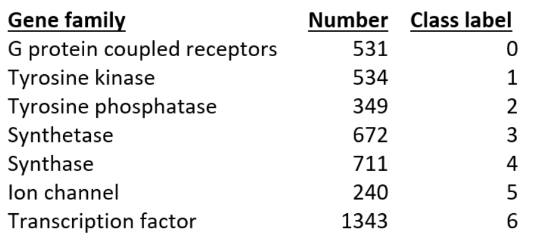

# BioSeq
An NLP based DNA Sequencing and Classification Model that takes in DNA data, performers K-Mers sequencing on it and subsequently classifies the DNA into gene family gruops. The gene groups are as follows:

